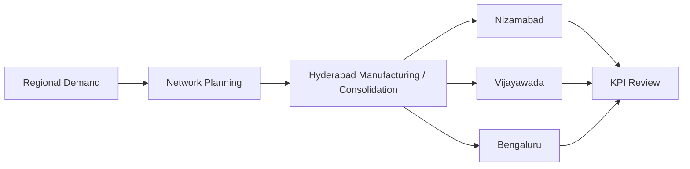

# Distribution Network Flow

```mermaid
flowchart LR
    A[Regional Demand] --> B[Network Planning]
    B --> C[Hyderabad Manufacturing / Consolidation]
    C --> D[Nizamabad]
    C --> E[Vijayawada]
    C --> F[Bengaluru]
    D --> G[KPI Review]
    E --> G
    F --> G
```

The flow represents the modeled distribution network from demand planning through regional delivery and KPI review.
