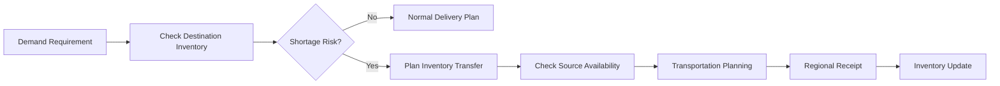

# Inventory Transfer Flow

```mermaid
flowchart LR
    A[Demand Requirement] --> B[Check Destination Inventory]
    B --> C{Shortage Risk?}
    C -- No --> D[Normal Delivery Plan]
    C -- Yes --> E[Plan Inventory Transfer]
    E --> F[Check Source Availability]
    F --> G[Transportation Planning]
    G --> H[Regional Receipt]
    H --> I[Inventory Update]
```

The flow illustrates how inventory-transfer decisions respond to projected regional shortages.
