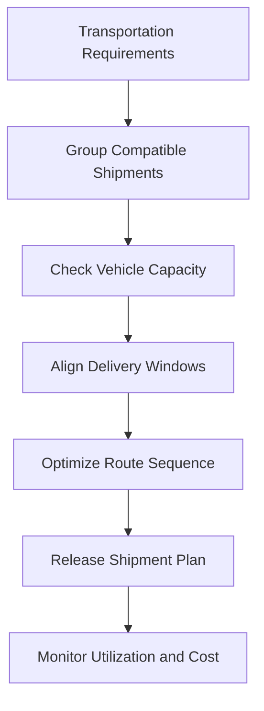

# Route Optimization Flow

```mermaid
flowchart TD
    A[Transportation Requirements] --> B[Group Compatible Shipments]
    B --> C[Check Vehicle Capacity]
    C --> D[Align Delivery Windows]
    D --> E[Optimize Route Sequence]
    E --> F[Release Shipment Plan]
    F --> G[Monitor Utilization and Cost]
```

The optimization flow is used to compare the baseline 12-trip scenario with the modeled 10-trip optimized scenario.
